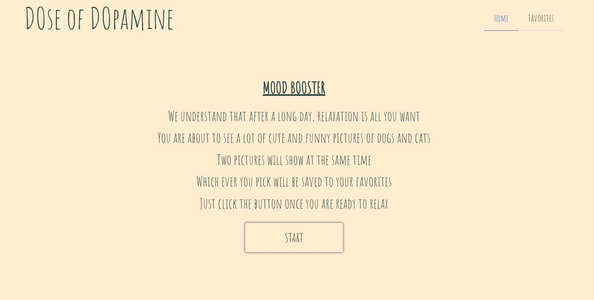
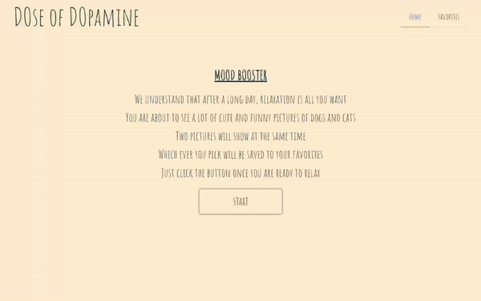
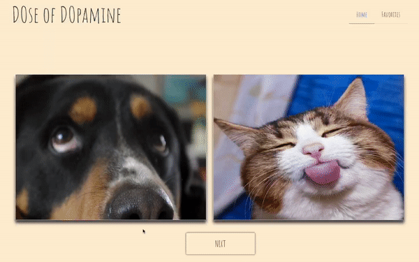
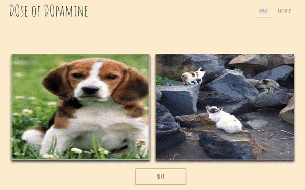
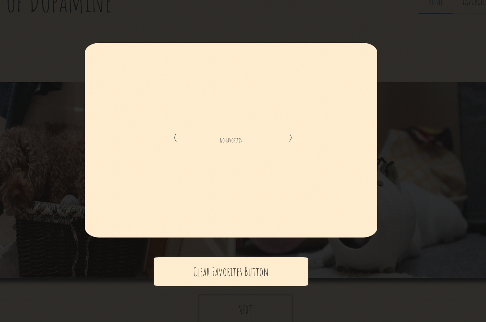

# Project 1: Interactive Front-End Application

This application is called Dose of Dopamine: The Mood Booster App. This app will provide you two pictures at the same time, one dog and one cat pictures. User will be able to pick between the two pictures, which will automatically save the selected picture to the user's Favorite section. The Favorite section can be accessed any time and will display all the pictures that were selected by the user.

This is a collaborative work to provide an interactive experience. This front-end application is created using to exhibit our knowledge in HTML, CSS, JavaScript, and APIs.
> Project Requirements:
* Utilizing CSS framework without using Bootstrap. Bulma is utilized to create the HTML file of this application.
* Two (2) server-side APIs utilized to provide content for the application.
* Interactive by saving each pictures selected by the user.
* Modals are utilized instead of alerts, confirms, or prompts.
* Client-side storage is utilized to store persistent data.

## User Story
>
 As a user who wants to relax at the end of a long day

>
 I WANT to be able to select a funny dog or cat picture

>
 SO THAT it will save in a Favorite section for me to view it in the future

## Accessing the Application
To access the application, you can follow the deployment link or download the source of files in the GitHub repository provided below.

<strong>Deployment Link:</strong> <a href="https://noahwesttech.github.io/We-Deserve-Arrays-Project-1/">Dose of Dopamine </a>

<strong>GitHub:</strong> <a href="https://github.com/noahwesttech/We-Deserve-Arrays-Project-1">GitHub Repository </a>

## Application Functionality
* Application will have a welcome page and a navigation bar.

* Application will initiate once the user clicks the start button.

* User will be able to select a picture between the two pictures exhibited and have that picture saved in the local storage.

* User will be shown two (2) new picture selections when next button is clicked.

* All pictures selected will be viewed through Favorite section

* User will have the option to clear the Favorite section.

